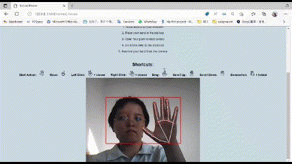

# Final Year Project (Python/Flask/Finger Tracking/Hand Tracking)
This is a Final Year Project of Asia Pacific University Student

**Course** : Computer Science(Intelligent System) 

**Keyword** : web-develop, Python, Flask, OpenCV, Model, Hand Tracking, Finger Tracking 

## Aim
To generate a web-based application to allow users to control the mouse by using finger-tracking technology

## Way to Use
Open your editor and run
> app.py

Then copy the local address that show at the terminal panel and run it on your browser

## Type of Action
**Move**

**Left Click & Right Click**

**Drag**

**Scroll Up and Down**

**Screenshot**

